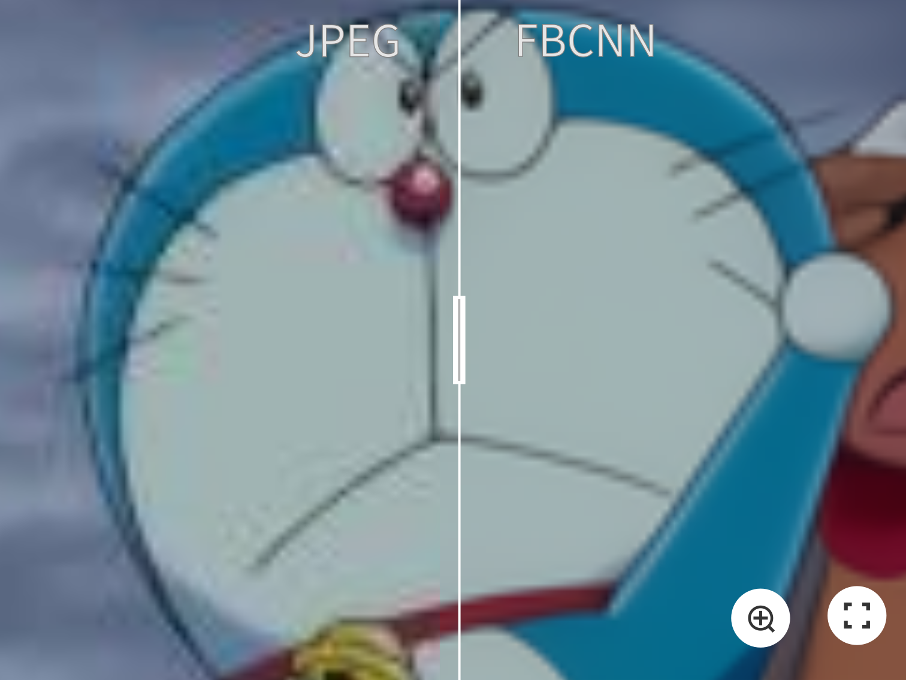
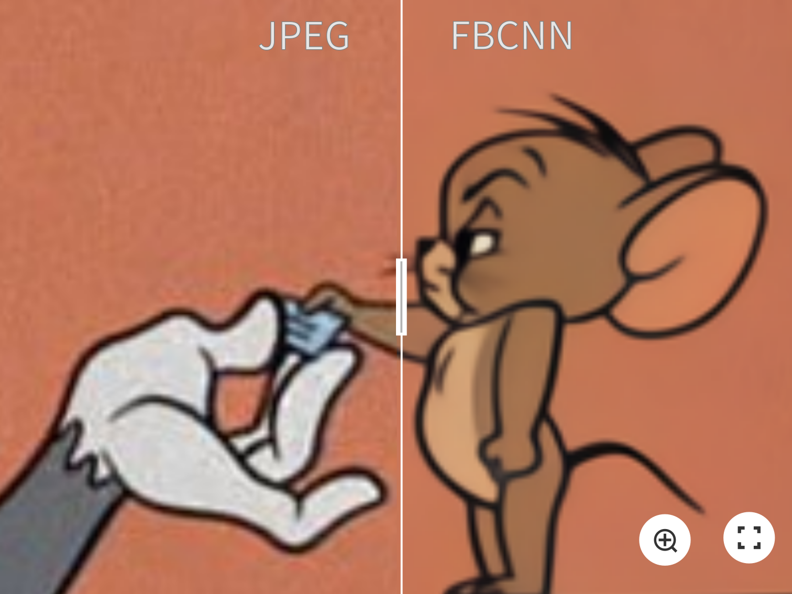
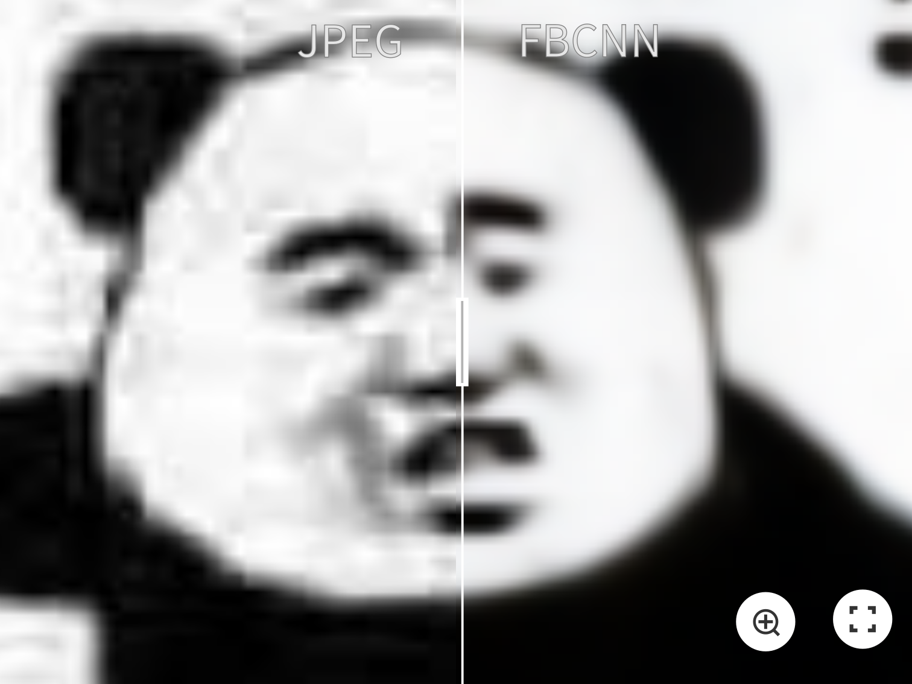
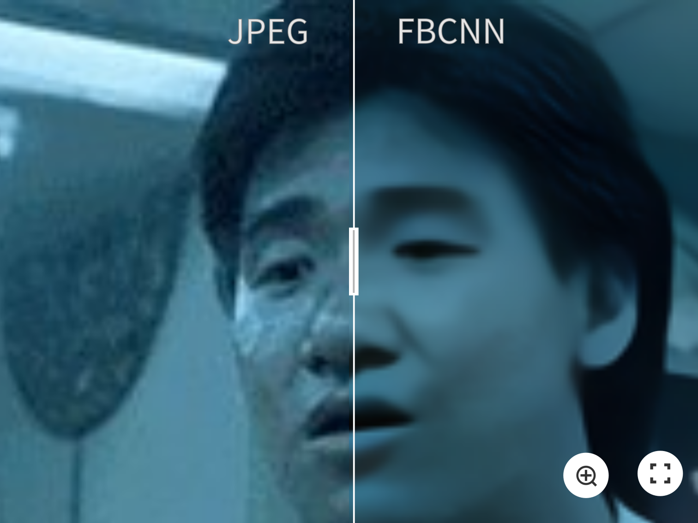
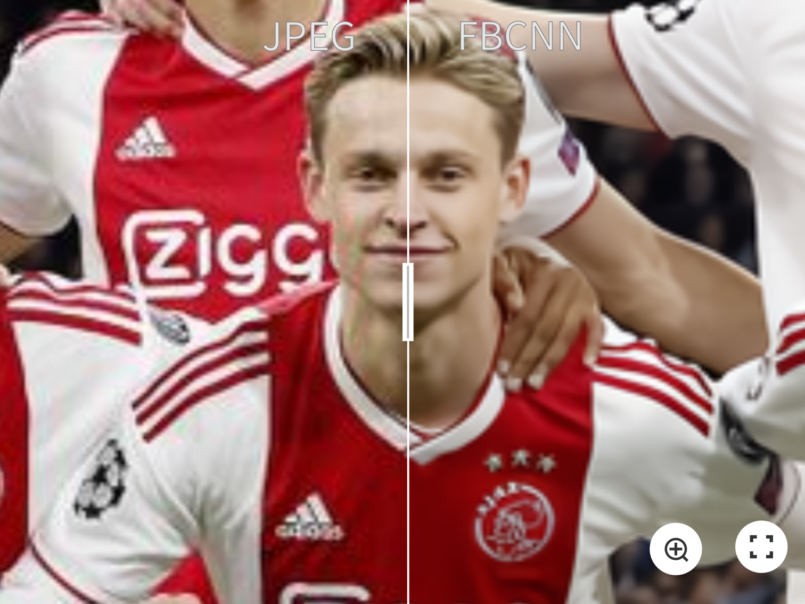
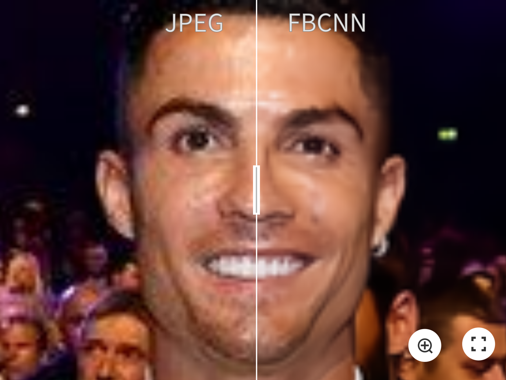

## [Towards Flexible Blind JPEG Artifacts Removal (FBCNN, ICCV 2021)](https://arxiv.org/abs/2109.14573)
[](https://arxiv.org/abs/2109.14573)
[](https://github.com/jiaxi-jiang/FBCNN)
[](https://github.com/jiaxi-jiang/FBCNN/releases)
 
 [](LICENSE)


[Jiaxi Jiang](https://jiaxi-jiang.github.io/), [Kai Zhang](https://cszn.github.io/), [Radu Timofte](http://people.ee.ethz.ch/~timofter/)

*[Computer Vision Lab](https://vision.ee.ethz.ch/), [ETH Zurich, Switzerland](https://ethz.ch/en.html)*

________
[Training](#training), [Testing](#testing)

:sunny::sunny:**Try your own JPEG images in a second by clicking on [Gradio Web Demo](https://huggingface.co/spaces/danielsapit/JPEG_Artifacts_Removal)!** Our model is integrated to [Huggingface Spaces](https://huggingface.co/spaces) with [Gradio](https://github.com/gradio-app/gradio).


:fire::fire: This repository is the official PyTorch implementation of paper "Towards Flexible Blind JPEG Artifacts Removal". [](https://arxiv.org/abs/2109.14573)
FBCNN achieves **state-of-the-art performance** in **BLIND** JPEG artifacts removal on
- Single JPEG images (color/grayscale)
- Double JPEG images (aligned/non-aligned)
- Real-world JPEG images


[](https://paperswithcode.com/sota/jpeg-artifact-correction-on-live1-quality-10?p=towards-flexible-blind-jpeg-artifacts-removal)
[](https://paperswithcode.com/sota/jpeg-artifact-correction-on-live1-quality-10-1?p=towards-flexible-blind-jpeg-artifacts-removal)
[](https://paperswithcode.com/sota/jpeg-artifact-correction-on-bsds500-quality?p=towards-flexible-blind-jpeg-artifacts-removal)
[](https://paperswithcode.com/sota/jpeg-artifact-correction-on-bsds500-quality-3?p=towards-flexible-blind-jpeg-artifacts-removal)
[](https://paperswithcode.com/sota/jpeg-artifact-correction-on-classic5-quality?p=towards-flexible-blind-jpeg-artifacts-removal)
[](https://paperswithcode.com/sota/jpeg-artifact-correction-on-icb-quality-10?p=towards-flexible-blind-jpeg-artifacts-removal)

>Training a single deep blind model to handle different quality factors for JPEG image artifacts removal has been attracting considerable attention due to its convenience for practical usage. However, existing deep blind methods usually directly reconstruct the image without predicting the quality factor, thus lacking the flexibility to control the output as the non-blind methods. To remedy this problem, in this paper, we propose a flexible blind convolutional neural network, namely FBCNN, that can predict the adjustable quality factor to control the trade-off between artifacts removal and details preservation. Specifically, FBCNN decouples the quality factor from the JPEG image via a decoupler module and then embeds the predicted quality factor into the subsequent reconstructor module through a quality factor attention block for flexible control. Besides, we find existing methods are prone to fail on non-aligned double JPEG images even with only a one-pixel shift, and we thus propose a double JPEG degradation model to augment the training data. Extensive experiments on single JPEG images, more general double JPEG images, and real-world JPEG images demonstrate that our proposed FBCNN achieves favorable performance against state-of-the-art methods in terms of both quantitative metrics and visual quality.

🚀🚀 Some Visual Examples (Click for full images)
----------
|[](https://imgsli.com/NzA3NTk) |[](https://imgsli.com/NzA3NjI)|
|:---:|:---:|
|[](https://imgsli.com/NzA3NjE) |[](https://imgsli.com/NzA3NjM)|
|[](https://imgsli.com/NzA3NjQ) |[](https://imgsli.com/NzA3NjU)|

________

Training
----------
For training, just run the following code:
```bash
python main_train_fbcnn.py
```
The `.json` configuration file for training is located in `./options/`

Testing
----------

- Grayscale JPEG images
```bash
python main_test_fbcnn_gray.py
```

- Grayscale JPEG images, trained with double JPEG degradation model
```bash
python main_test_fbcnn_gray_doublejpeg.py
```

- Color JPEG images
```bash
python main_test_fbcnn_color.py
```

- Real-World JPEG images
```bash
python main_test_fbcnn_color_real.py
```

___________

Contents
----------

* [Motivations](#motivations)
* [Network Architecture](#network-architecture)
* [Analysis of Double JPEG Restoration](#analysis-of-double-jpeg-restoration)
* [Experiments](#experiments)
* [Citation](#citation)
* [License and Acknowledgement](#license-and-acknowledgement)

Motivations
----------
JPEG is one of the most widely-used image compression algorithms and formats due to its simplicity and fast encoding/decoding speeds. However, it is a lossy compression algorithm and can introduce annoying artifacts. Existing methods for JPEG artifacts removal generally have four limitations in real applications: 

- Most existing learning-based methods [e.g. ARCNN, MWCNN, SwinIR] trained a specific model for each quality factor, lacking the flexibility to learn a single model for different JPEG quality factors. 

- DCT-based methods [e.g. DMCNN, QGAC] need to obtain the DCT coefficients or quantization table as input, which is only stored in JPEG format. Besides, when images are compressed multiple times, only the most recent compression information is stored. 

- Existing blind methods [e.g. DnCNN, DCSC, QGAC] can only provide a deterministic reconstruction result for each input, ignoring the need for user preferences. 

- Existing methods are all trained with synthetic images which assumes that the low-quality images are compressed only once. _**However, most images from the Internet are compressed multiple times.**_ Despite some progress for real recompressed images, e.g. from Twitter [ARCNN, DCSC], a detailed and complete study on double JPEG artifacts removal is still missing. 


Network Architecture
----------

We propose a flexible blind convolutional neural network (FBCNN) that predicts the quality factor of a JPEG image and embed it into the decoder to guide image restoration. The quality factor can be manually adjusted for flexible JPEG restoration according to the user's preference.


Analysis of Double JPEG Restoration
----------
###  1. What is non-aligned double JPEG compression?

Non-aligned double JPEG compression means that the 8x8 blocks of two JPEG compression are not aligned. For example, when we crop a JPEG image and save it also as JPEG, it is highly possible we get a non-aligned double JPEG image. 

There are many other common scenarios including, but not limited to:
- take a picture by smartphone and upload it online. Most social media platforms, e.g. Wechat, Twitter, Facebook, resize the uploaded images by downsampling and then apply JPEG compression to save storage space.
- Edit a JPEG image that introduces cropping, rotation, or resizing, and save it as JPEG.
- Zoom in/out a JPEG image, then take a screenshot, save it as JPEG.
- Group different JPEG image and save it as a single JPEG image.
- Most memes are compressed many times with non-aligned cases.

###  2. Limitation of existing blind methods on restoration of non-aligned double JPEG images

We find that existing blind methods always do not work when the 8x8 blocks of two JPEG compression are not aligned and QF1 <= QF2, _**even with just a one-pixel shift.**_ Other cases such as non-aligned double JPEG with QF1>QF2, or aligned double JPEG compression, are actually equivalent to single JPEG compression.

Here is an example of the restoration result of DnCNN and QGAC on a JPEG image with different degradation settings. '*' means there is a one-pixel shift between two JPEG blocks.


###  3. Our solutions
We find for non-aligned double JPEG images with QF1 < QF2, FBCNN always predicts the quality factor as QF2. However, it is the smaller QF1 that dominants the compression artifacts. By manually changing the predicted quality factor to QF1, we largely improve the result.

Besides, to get a fully blind model, we propose two blind solutions to solve this problem:

(1) FBCNN-D: Train a model with a single JPEG degradation model + automatic dominant QF correction. By utilizing the property of JPEG images, we find the quality factor of a single JPEG image can be predicted by applying another JPEG compression. When QF1 = QF2, the MSE of two JPEG images is minimal. In our paper, we also extend this method to non-aligned double JPEG cases to get a fully blind model.

(2) FBCNN-A: Augment training data with double JPEG degradation model, which is given by:

<p align="center">
    y = JPEG(shift(JPEG(x, QF1)),QF2)
</p>

By reducing the misalignment of training data and real-world JPEG images, FBCNN-A further improves the results on complex double JPEG restoration. _**This proposed double JPEG degradation model can be easily integrated into other image restoration tasks, such as single image super-resolution (e.g. [BSRGAN](https://github.com/cszn/BSRGAN)), for better general real image restoration.**_


Experiments
----------

### 1. Single JPEG restoration

*: Train a specific model for each quality factor.


### 2. Non-aligned double JPEG restoration
There is a pixel shift of (4,4) between the blocks of two JPEG compression.


### 3. Real-world JPEG restoration


### 4. Flexibility of FBCNN
By setting different quality factors, we can control the trade-off between artifacts removal and details preservation, according to the user's preference.


Citation
----------

    @inproceedings{jiang2021towards,
      title={Towards Flexible Blind JPEG Artifacts Removal},
      author={Jiang, Jiaxi and Zhang, Kai and Timofte, Radu},
      booktitle={Proceedings of the IEEE/CVF International Conference on Computer Vision},
      pages={4997--5006},
      year={2021}
      }

License and Acknowledgement
----------
This project is released under the Apache 2.0 license. This work was partly supported by the ETH Zürich Fund (OK) and a Huawei Technologies Oy (Finland) project.
