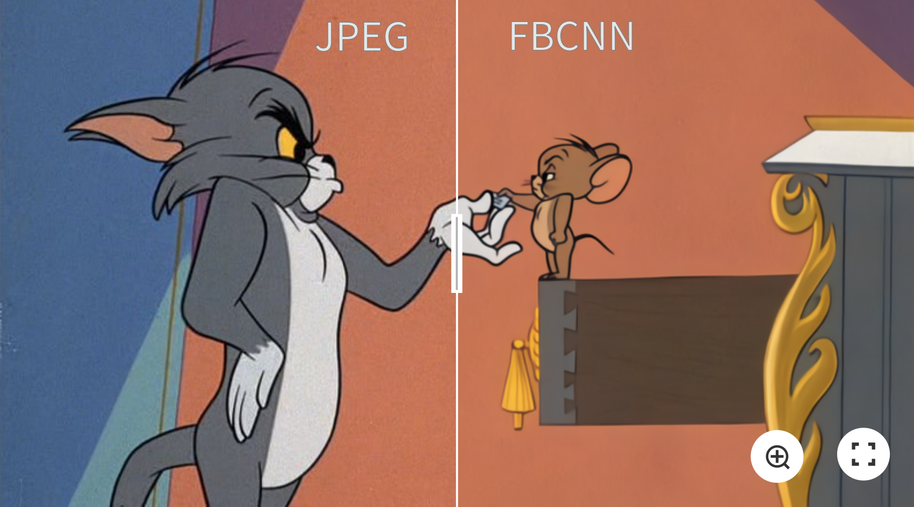
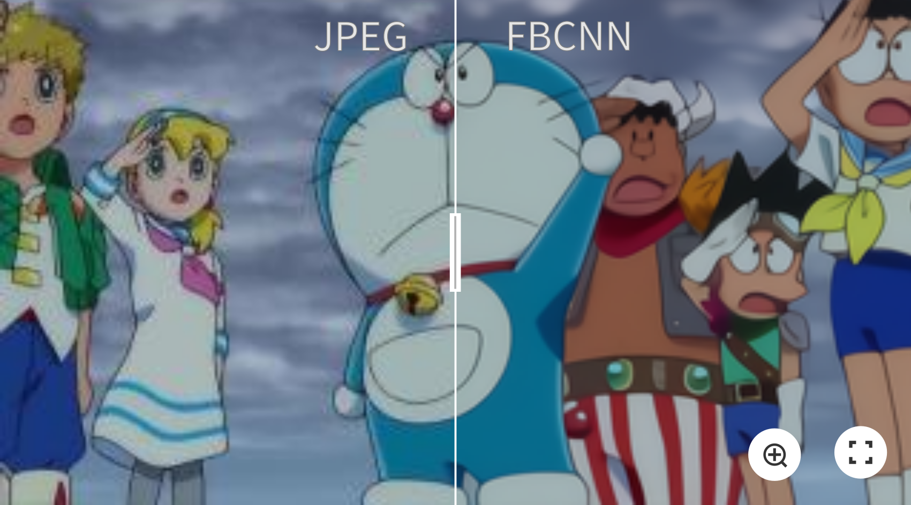
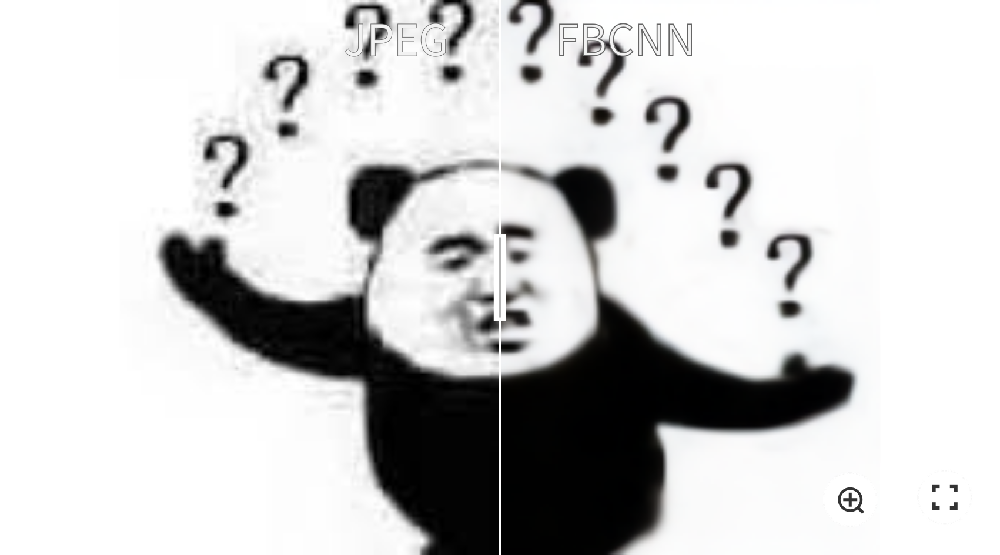
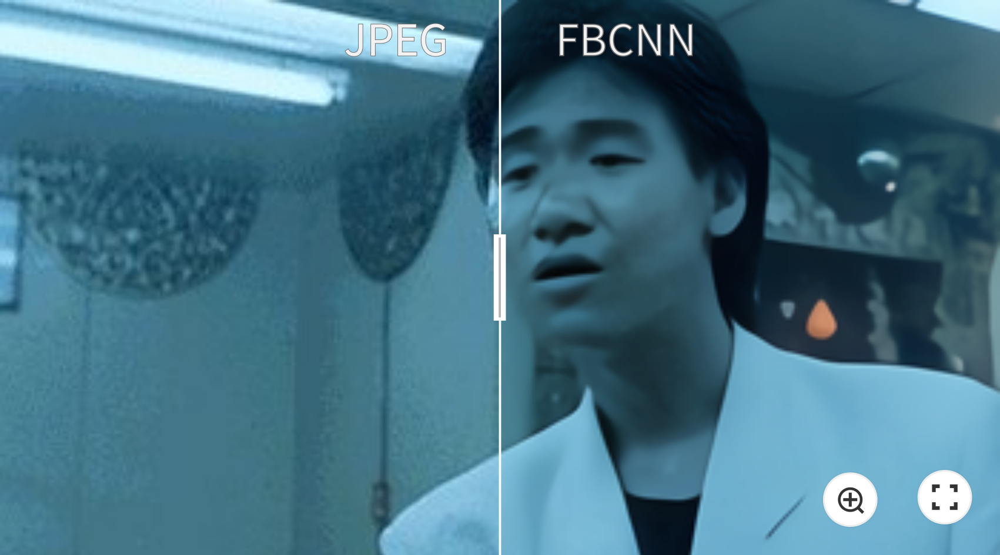
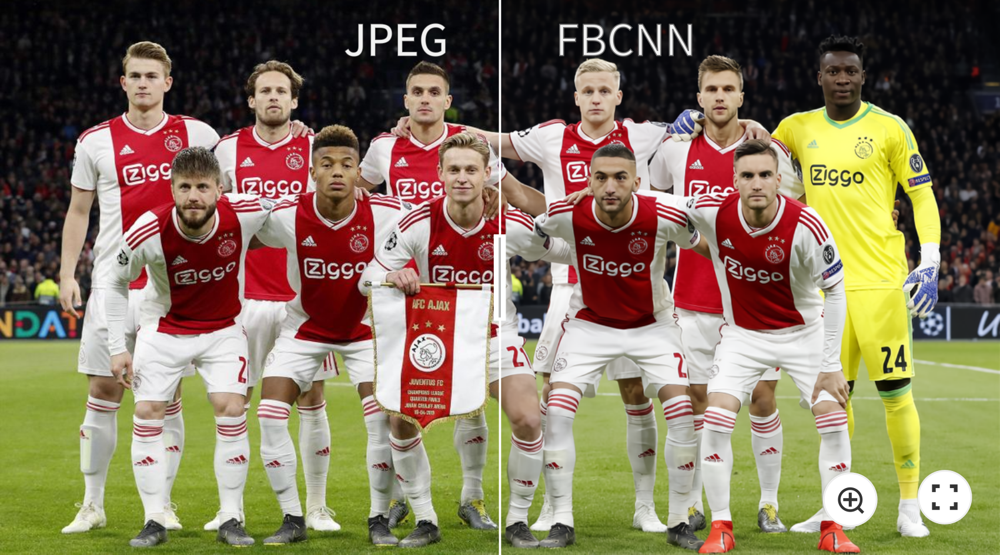
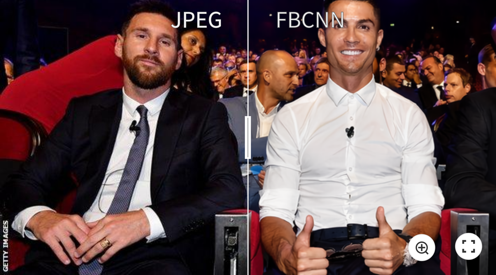

## Towards Flexible Blind JPEG Artifacts Removal (ICCV 2021) (PyTorch)

Jiaxi Jiang, Kai Zhang, Radu Timofte

Computer Vision Lab, ETH Zurich, Switzerland

________
✨ _**Some visual examples (click the images for more details)**_:

[](https://imgsli.com/NzA3NjI)
[](https://imgsli.com/NzA3NTk)
[](https://imgsli.com/NzA3NjE)
[](https://imgsli.com/NzA3NjM)
[](https://imgsli.com/NzA3NjQ)
[](https://imgsli.com/NzA3NjU)

________

### 1. Motivations
JPEG is one of the most widely-used image compression algorithms and formats due to its simplicity and fast encoding/decoding speeds. However, it is a lossy compression algorithm and can introduce annoying artifacts. Existing methods for JPEG artifacts removal generally have four limitations in real applications: 

a. Most existing learning-based methods [e.g. ARCNN, MWCNN, SwinIR] trained a specific model for each quality factor, lacking the flexibility to learn a single model for different JPEG quality factors. 

b. DCT-based methods [e.g. DMCNN, QGAC] need to obtain the DCT coefficients or quantization table as input, which is only stored in JPEG format. Besides, when images are compressed multiple times, only the most recent compression information is stored. 

c. Existing blind methods [e.g. DnCNN, DCSC, QGAC] can only provide a deterministic reconstruction result for each input, ignoring the need for user preferences. 

d. Existing methods are all trained with synthetic images which assumes that the low-quality images are compressed only once. However, most images from the Internet are compressed multiple times. Despite some progress for real recompressed images, e.g. from Twitter [ARCNN, DCSC], a detailed and complete study on double JPEG artifacts removal is still missing. 


### 2. Network Architecture
We propose a flexible blind convolutional neural network (FBCNN) that predicts the quality factor of a JPEG image and embed it into the decoder to guide image restoration. The quality factor can be manually adjusted for flexible JPEG restoration according to the user's preference.


### 3. Consideration on Restoration of Double JPEG Restoration
#### a. Limitation of Existing Blind Methods
We find that existing blind methods always do not work when the 8x8 blocks of two JPEG compression are not aligned and QF1 <= QF2, _**even with just a one-pixel shift.**_ Other cases such as non-aligned double JPEG with QF1>QF2, or aligned double JPEG compression, are actually equivalent to single JPEG compression.

Here is an example of the restoration result of DnCNN and QGAC on a JPEG image with different degradation settings. '*' means there is a one-pixel shift between two JPEG blocks.


#### b. Our Solutions
We find for non-aligned double JPEG images with QF1 < QF2, FBCNN always predicts the quality factor as QF2. However, it is the smaller QF1 that dominants the compression artifacts. By manually changing the predicted quality factor to QF1, we largely improve the result.

Besides, to get a fully blind model, we propose two blind solutions to solve this problem:

(1) FBCNN-D: Train a model with a single JPEG degradation model + automatic dominant QF correction. By utilizing the property of JPEG images, we find the quality factor of a single JPEG image can be predicted by applying another JPEG compression. When QF1 = QF2, the MSE of two JPEG images is minimal. In our paper, we also extend this method to non-aligned double JPEG cases to get a fully blind model.

(2) FBCNN-A: Augment training data with double JPEG degradation model, which is given by:

<p align="center">
    y = JPEG(shift(JPEG(x, QF1)),QF2)
</p>

By reducing the misalignment of training data and real-world JPEG images, FBCNN-A further improves the results on complex double JPEG restoration. _**This proposed double JPEG degradation model can be easily integrated into other image restoration tasks, such as Single Image Super-Resolution, for better general real image restoration.**_

To the best of our knowledge, we are the first to tackle the problem of restoration of non-aligned double JPEG compression. As JPEG is the most widely used image compression algorithm and format, and most real-world JPEG images are compressed many times, we believe it would be a significant step towards real image restoration. 

### 3. Experiments

#### a. Single JPEG Restoration

*: Train a specific model for each quality factor.


#### b. Non-Aligned Double JPEG Restoration
There is a pixel shift of (4,4) between the blocks of two JPEG compression.


#### c. Real JPEG Restoration


#### d. Flexibility of FBCNN
By setting different quality factors, we can control the trade-off between artifacts removal and details preservation.

### 4. Training
We will release the training code at [KAIR](https://github.com/cszn/KAIR/).

### 5. Testing
#### a. Grayscale Images (Calculate Metrics)
Put the folder with uncompressed grayscale or Y channel images (Classic5, LIVE1, BSDS500, etc.) under `testsets`. This code generates compressed JPEG images and calculates PSNR, SSIM, PSNRB.

###### Single JPEG Restoration
```bash
python main_test_fbcnn_gray.py
```
###### Double JPEG Restoration
```bash
python main_test_fbcnn_gray_doublejpeg.py
```

#### b. Color Images (Calculate Metrics)
Put the folder with uncompressed images (LIVE1, BSDS500, ICB, etc.) under `testsets`. This code generates compressed JPEG images and calculates PSNR, SSIM, PSNRB.

```bash
python main_test_fbcnn_color.py
```
#### c. Real-World Images (Real Application)
Put the folder with real-world compressed images under `testsets`. This code restores the images without calculating metrics. Please note by setting different quality factors, we can control the trade-off between artifacts removal and details preservation.
```bash
python main_test_fbcnn_color_real.py
```

### Citation
    @inproceedings{jiang2021towards,
    title={Towards Flexible Blind {JPEG} Artifacts Removal},
    author={Jiang, Jiaxi and Zhang, Kai and Timofte, Radu},
    booktitle={IEEE International Conference on Computer Vision},
    year={2021}
    }
